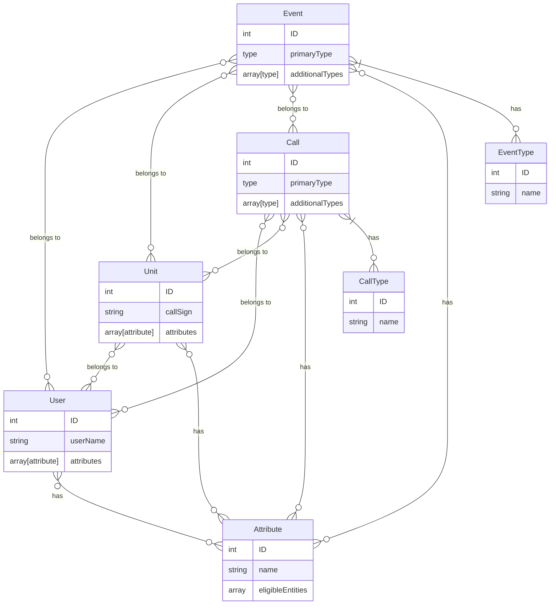

```mermaid
    erDiagram
    
    %% Definitions for all entities

    Unit {
        int ID
        string callSign
        array[attribute] attributes
        %% attributes could be type of unit, rank/permissions, etc...
    }
    
    Event {
        int ID
        type primaryType
        array[type] additionalTypes
    }
        
    Call {
        int ID
        type primaryType
        array[type] additionalTypes
    }
    
    User {
        int ID
        string userName
        array[attribute] attributes
    }

    Attribute {
        int ID
        string name
        array eligibleEntities
        %% entities this attribute can be assigned to
    }

    CallType {
        int ID
        string name
    }

    EventType {
        int ID
        string name
    }

    %% Entity relationships

    Unit }o--o{ User: "belongs to"

    Event }o--o{ User: "belongs to"
    Event }o--o{ Unit: "belongs to"


    Call }o--o{ User: "belongs to"
    Call }o--o{ Unit: "belongs to"

    Event }o--o{ Call: "belongs to"

    Unit }o--o{ Attribute: "has"
    User }o--o{ Attribute: "has"
    Event }o--o{ Attribute: "has"
    Call }o--o{ Attribute: "has"

    Call }|--o{ CallType: "has"
    Event }|--o{ EventType: "has"


```